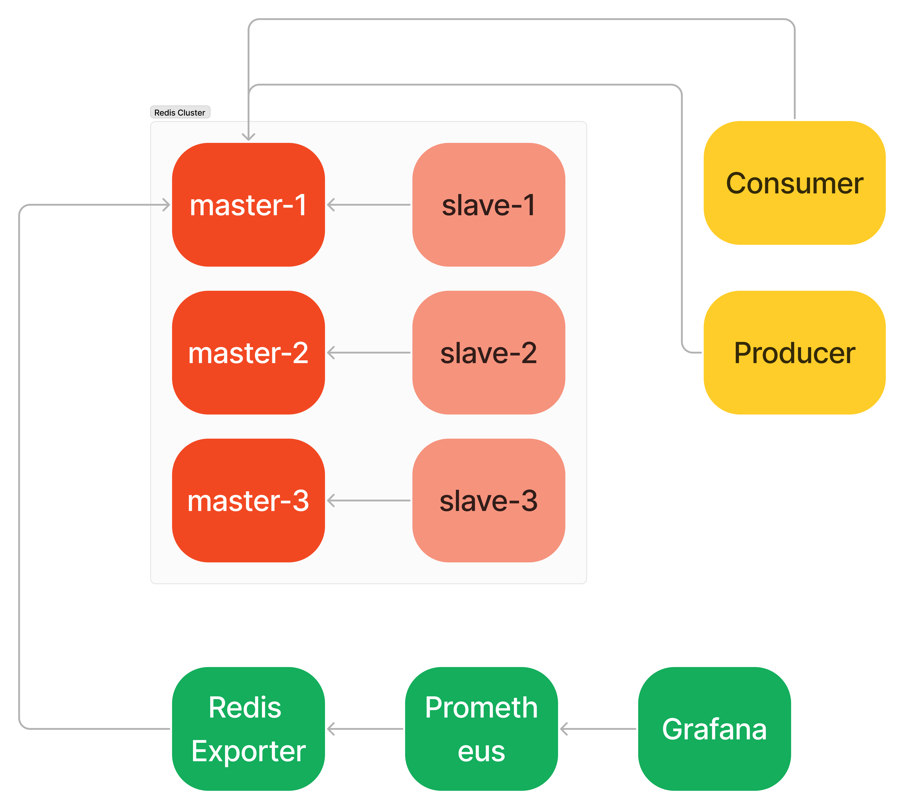
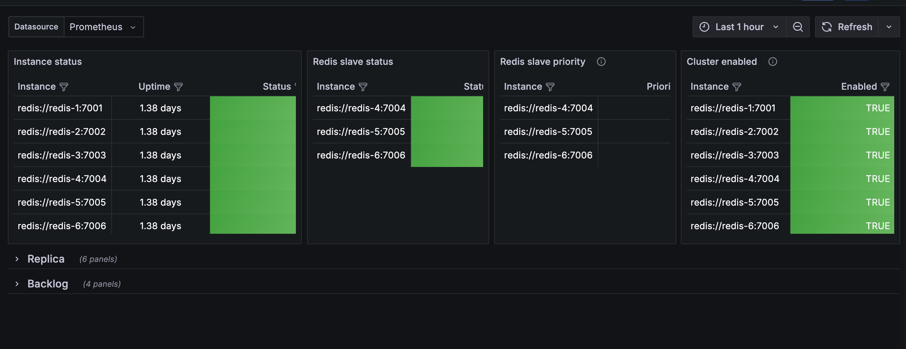
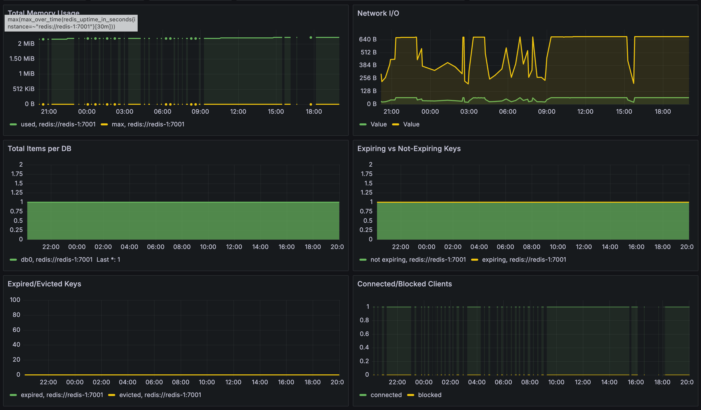

# redis-streams-tutorial

## 베이스라인: RabbitMQ

ACK설정, Message Persistence에 따라서 메세지 유실이 발생할 수 있습니다.
- 설정이 다소 복잡할 수 있습니다.

큐 동기화 지연 문제를 가지고 있습니다.
- Master Node와 Replica Node간의 동기화 지연이 발생할 수 있습니다.

RabbitMQ는 Cluster구성시 Master Node를 Single로 운영합니다. 따라서 Single Master Node의 한계점을 가집니다.
- Master node가 장애로 인해 중단되기 전에 replication이 완료되지 않았다면, 데이터 손실이 발생할 수 있습니다.
- Master node가 다운되면 slave 중 하나를 새로운 master로 승격해야 하며, 이 과정에서 downtime이 발생할 수 있습니다.

## 제안: Redis Stream



Redis는 비교적 설정이 간단한 편이고 Shard기반 Multi Master를 제공합니다. 따라서 부하를 분산시킬 수 있으며 Master 오류시 문제를 최소화하고 데이터 손실을 최소화 할 수 있습니다.
Redis로 처리하기 힘든 수준의 부하라면 Kafka를 제안드릴 수 있을 것 같습니다. 다만, On-Premise 배포 특성상 Redis로도 충분한 부하일 것으로 예상되어 Redis를 먼저 제안드리게되었습니다.

### Append-Only Log 모델
Redis Streams는 큐(Queue) 방식이 아닌 Append-Only Log 모델이므로, 메시지 이력을 일정 부분(또는 완전히) 유지할 수 있어 장애 복원이나 재처리 시나리오가 보다 수월합니다. (RabbitMQ Stream도 log방식)

### 설정의 복잡도

Redis 자체가 비교적 간단한 설정 방식을 가지며, Stream 관련 명령(XADD, XREADGROUP, XACK 등) 역시 직관적입니다.
추가 브로커 없이 Redis 인스턴스(또는 클러스터)에서 곧바로 스트림 기능을 사용할 수 있으므로 구성 난이도가 낮습니다.

RDB(주기적 스냅샷)와 AOF(Append Only File) 옵션을 통해 메시지 유실을 최소화할 수 있습니다.
Redis는 기본적으로 인메모리 구조이지만, 필요에 따라 영속성(Persistence) 관련 파라미터를 간단히 조정하여 원하는 수준의 신뢰성을 확보할 수 있습니다.

Redis Streams의 컨슈머 그룹은 XACK 명령어를 사용해 메시지 처리가 완료되었음을 간단히 알릴 수 있으며, 미처리 메시지(ACK가 되지 않은 메시지)를 재할당할 수 있는 구조를 제공합니다.
RabbitMQ의 ACK, NACK 설정과 달리, Redis Streams에서 컨슈머 그룹 기반으로 ACK/재처리 로직을 구현하는 과정이 좀 더 단순화되어 있습니다.

### Master Replica 동기화

Redis는 클러스터 모드(Sharding)와 Sentinel을 활용한 자동 장애 감지 및 Failover 시스템을 갖추고 있습니다.
클러스터 구성 시, 각 샤드가 독립적인 키 스페이스를 담당해 부하가 분산되므로, 한 노드에 집중되는 부하가 상대적으로 줄어드는 이점이 있습니다.

Redis의 Replica는 master-slave 구조로, 비동기 또는 반동기 복제를 수행하며, 일반적으로 Mirror Queue 대비 구조가 단순합니다.
동기화 지연이 완전히 없어지는 것은 아니지만, Redis 내부 로직이 단순해 운영 및 모니터링이 상대적으로 용이하고 문제가 발생해도 빠르게 파악하기 쉽습니다.

Redis Streams는 인메모리 기반이어서, 장애 복구 후에 정상 노드(혹은 새 마스터)가 컨슈머 그룹 상태를 빠르게 되찾고, ACK되지 않은 메시지를 신속히 재할당할 수 있습니다.
Redis Sentinel과 연동하면 장애 발생 시점을 탐지하고 즉시 자동으로 마스터 교체를 진행하므로, 복구 지연 시간이 상대적으로 짧은 편입니다.


### 샤딩(Shard) 기반 다중 마스터


Redis Cluster는 여러 샤드 각각에 마스터-슬레이브(Replica)를 구성하여, 전체적으로 다수의 마스터가 분산되어 운영됩니다.
특정 노드 장애 시, 해당 노드의 Replica 중 하나가 빠르게 승격됨으로써 부분적인 다운타임만 발생하며, 다른 샤드는 정상 동작을 유지합니다.

Redis Sentinel 혹은 Cluster는 자동으로 마스터를 감지하고 Failover를 수행해줍니다.
장애 시점에 따른 일부 데이터(메시지) 손실 가능성은 여전히 존재할 수 있지만, Failover 속도가 상대적으로 빠르고, RDB/AOF를 활용해 유실 범위를 줄일 수 있습니다.

Redis Cluster는 키를 해시 슬롯으로 분산 저장하므로, 특정 노드 장애가 전체 스트림 운영에 치명타가 될 가능성을 줄여줍니다. 또한 동기화 부하도 분산할 수 있습니다.
RabbitMQ처럼 하나의 큐 마스터에 모든 메시지가 집중되지 않으므로, 부하 분산 및 점진적 확장(노드 증설)이 용이합니다.

Reference: https://redis.io/technology/redis-enterprise-cluster-architecture/


## Tutorial

Redis 클러스터를 생성하기 위해서 아래 명령어를 실행합니다.
```
make redis-cluster
```

cluster 노드 정보를 확인합니다.
Master, Slave 각각 3개씩 생성됩니다.

```
docker exec -it redis-1 redis-cli -p 7001
127.0.0.1:7001> cluster nodes
21fdb1f289c80f8b469fa4b949e5bb5f71b6df98 10.0.0.14:7004@17004 slave de5b6c6cbe29e759831487e31c08317cca23008d 0 1736766603439 3 connected
911bf7ebf83c6f841436a27bafcf374d2ef7fc6c 10.0.0.16:7006@17006 slave d147d15ae692fbc54e6abe5cf0f2dd7223578915 0 1736766603957 2 connected
d147d15ae692fbc54e6abe5cf0f2dd7223578915 10.0.0.12:7002@17002 master - 0 1736766603000 2 connected 5461-10922
5ae037b9b6524a36bf5397a940a9ac564146aa55 10.0.0.15:7005@17005 slave 2eb5bd9bf11c91b0a397f90fad4b196b34908064 0 1736766603557 1 connected
de5b6c6cbe29e759831487e31c08317cca23008d 10.0.0.13:7003@17003 master - 0 1736766601894 3 connected 10923-16383
2eb5bd9bf11c91b0a397f90fad4b196b34908064 10.0.0.11:7001@17001 myself,master - 0 1736766602000 1 connected 0-5460
```

| Role   | Node ID                             | IP:Port       | Master Node ID                      | Slot Range    |
|--------|-------------------------------------|---------------|-------------------------------------|---------------|
| Master | 2eb5bd9bf11c91b0a397f90fad4b196b34908064 | 10.0.0.11:7001 | -                                   | 0-5460        |
| Slave  | 5ae037b9b6524a36bf5397a940a9ac564146aa55 | 10.0.0.15:7005 | 2eb5bd9bf11c91b0a397f90fad4b196b34908064 | -             |
| Master | d147d15ae692fbc54e6abe5cf0f2dd7223578915 | 10.0.0.12:7002 | -                                   | 5461-10922    |
| Slave  | 911bf7ebf83c6f841436a27bafcf374d2ef7fc6c | 10.0.0.16:7006 | d147d15ae692fbc54e6abe5cf0f2dd7223578915 | -             |
| Master | de5b6c6cbe29e759831487e31c08317cca23008d | 10.0.0.13:7003 | -                                   | 10923-16383   |
| Slave  | 21fdb1f289c80f8b469fa4b949e5bb5f71b6df98 | 10.0.0.14:7004 | de5b6c6cbe29e759831487e31c08317cca23008d | -             |


Redis Cluster에서는 Shard마다 하나의 Master 노드가 있고, 각 Shard는 여러 Slave 노드를 통해 고가용성을 유지합니다. 이를 통해 부하가 분산되고, 하나의 Master 노드가 다운되더라도 다른 Shard에는 영향이 없습니다. 또한, 비동기 복제를 통해 데이터 유실 및 다운타임을 최소화할 수 있습니다. 다만, 장애 발생 직전의 일부 데이터는 복제되지 않을 수 있습니다.

RabbitMQ는 Single Master 기반의 클러스터링을 지원합니다. 따라서 Master 노드가 다운되면 해당 큐에 대한 접근이 일시적으로 중단될 수 있어 고가용성을 완전히 보장하지는 않습니다. 또한, 데이터 부하가 심할 경우 비동기 복제 방식으로 인해 데이터 유실 가능성이 높아질 수 있습니다.

Redis Cluster에 Message를 생성합니다.

```
make producer
```

Message를 소비합니다.
```
make consumer
```

## Monitoring

Redis Exporter의 정보를 Prometheus를 이용해서 Scrape합니다. 이 데이터를 Grafana Dashboard에서 시각화하였습니다.



- Reference: https://grafana.com/grafana/dashboards/21914-redis-cluster/


- Reference: https://grafana.com/grafana/dashboards/763-redis-dashboard-for-prometheus-redis-exporter-1-x/

## TODO

- [ ]: RabbitMQ도 Stream(Log방식), Shard를 지원합니다. 시간관계상 Redis Stream과 차이를 직접 비교하지 못했습니다.
- [ ]: Kafka에 대한 검토도 필요합니다. 이번에는 비교적 간단하게 세팅할 수 있는 Redis를 제안드렸습니다.


## 마치면서

RabbitMQ에 대한 경험은 없었지만, 조사를 통해 느낀 점은 어떤 도구를 선택하느냐도 중요하지만, 선택한 도구의 기능을 충분히 탐색하고 활용하는 것이 중요하다고 생각합니다. RabbitMQ 역시 Stream, Shard(Plugin), 그리고 Durability를 위한 다양한 설정을 제공하고 있었습니다. 이러한 기능들이 실제로 어느 정도의 성능을 제공하며, 부하 테스트나 실제 환경에서 얼마나 안정적으로 동작하는지 검증하는 것은 필요하다고 생각합니다.

다만, RabbitMQ에는 설계상의 한계도 존재했습니다. Redis와 Kafka는 처음부터 Shard 기반의 분산 아키텍처로 설계된 반면, RabbitMQ는 플러그인을 통해 이와 유사한 기능을 구현해야 하며, 이는 비교적 복잡한 설정과 추가적인 관리 작업을 요구합니다. 이러한 추가 설정은 시스템 설계의 안정성을 다소 저하시킬 가능성이 있어 보입니다.